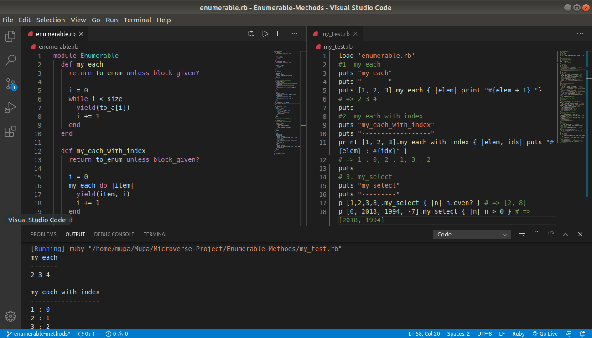

# Enumerable Methods
This project involves rebuilding some methods from the Ruby Enumerable Module.



## Methods Rebuilt
- .each
- .each_with_index
- .select
- .all?
- .any?
- .none?
- .count
- .map
- .inject

## Built With

- Ruby

## Getting Started
- Ensure you have Ruby installed on your computer.
- ```git clone https://github.com/Mupa1/Enumerable-Methods.git``` to your local computer.
- git checkout enumerable-methods
- cd into the folder and open enumerable.rb

## Usage
Use my enumerable methods like ruby's enumerable methods:

- my_each == each
- my_each_with_index == each_with_index
- my_select == select
- my_count == count
- my_all == all
- my_any == any
- my_none == none
- my_map == map
- my_inject == inject

## Automated Test
No automated test implemented yet for this project.

## Author

- Github: [@mupa1](https://github.com/Mupa1)
- Twitter: [@mupa_mmbetsa](https://twitter.com/mupa_mmbetsa)
- Linkedin: [mupa-mmbetsa](https://www.linkedin.com/in/mupa-mmbetsa)

## 🤝 Contributing

Contributions, issues and feature requests are welcome!

Feel free to check the [issues page](https://github.com/Mupa1/Enumerable-Methods/issues)

## Show your support

Give a ⭐️ if you like this project!

## 📝 License

This project is [MIT](lic.url) licensed.
